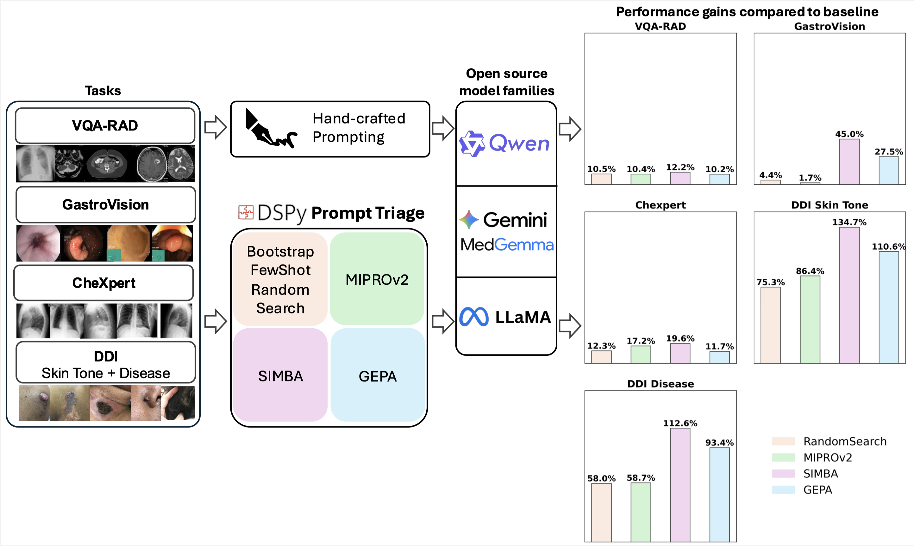

# Medical Vision-Language Model Optimization Framework

This framework provides a comprehensive evaluation and optimization system for medical vision-language models using DSPy. It includes evaluation metrics, multiple medical datasets, and optimization strategies.


- **5 Medical VLM Experiments**:
  - [VQA RAD](https://huggingface.co/datasets/flaviagiammarino/vqa-rad): Visual Question Answering on Radiology images
  - [Gastrovision](https://github.com/DebeshJha/GastroVision): Gastroenterology endoscopy classification
  - [CheXpert](https://aimi.stanford.edu/datasets/chexpert-chest-x-rays): Chest X-ray classification
  - [DDI](https://ddi-dataset.github.io) Disease: Dermatology disease diagnosis
  - [DDI](https://ddi-dataset.github.io) Skintone: Skin tone classification

  All datasets analyzed in this study are publicly available. No proprietary or restricted datasets are used.


- **4 [DSPy](https://dspy.ai) Optimization Strategies**:
  - BootstrapFewShotWithRandomSearch
  - MIPROv2
  - SIMBA
  - GEPA

## Framework Overview



## Installation

```bash
pip install -r requirements.txt
```

## Usage

### Running Single Experiments

```bash
python scripts/run_experiment.py \
  --experiment vqa_rad \
  --model "your-model-name" \
  --api_base "your-api-base" \
  --api_key "your-api-key"
```

### Running Batch Experiments

```bash
python scripts/batch_run.py \
  --model "your-model-name" \
  --api_base "your-api-base" \
  --api_key "your-api-key" \
  --experiments vqa_rad chexpert
```

### Available Experiments

- `vqa_rad`: Visual Question Answering on Radiology images
- `chexpert`: Chest X-ray classification
- `ddi_disease`: Dermatology disease diagnosis
- `ddi_skintone`: Skin tone classification
- `gastrovision`: Gastroenterology endoscopy classification

## Configuration

The framework uses configurable paths in `config/paths.py`. Update the `BASE_DATA_DIR` to point to your data directory:

```python
BASE_DATA_DIR = Path("/your/data/directory")
```

## Directory Structure

```
medvlm_optimization/
├── config/               # Configuration files
├── src/
│   ├── experiments/      # Individual experiment implementations
│   ├── utils/           # Utility functions
│   ├── metrics.py       # Evaluation metrics
│   └── main.py          # Main execution logic
├── scripts/             # CLI scripts
├── outputs/             # Generated logs and results
└── requirements.txt     # Python dependencies
```

## Output

Results are logged to `outputs/logs/` with detailed experiment information and performance metrics.

## Data Requirements

The framework expects data in the following structure:
- CheXpert: CSV files with image paths and labels
- DDI: CSV metadata files and image directories
- Gastrovision: CSV files with base64-encoded images
- VQA RAD: Loads from HuggingFace datasets


## License
This project is licensed under the MIT License.